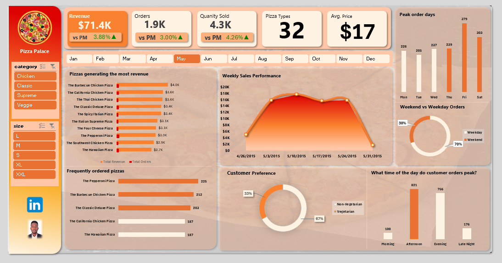
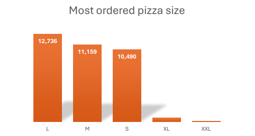

# Pizza Sales Performance & Revenue Analysis

## Executive Summary

This report analyzes pizza sales data to understand **customer ordering behavior**, **product preferences**, **pricing trends**, and **overall revenue performance**.  
The objective is to uncover actionable patterns that support better business decisions around **sales planning, pricing strategy, and product focus**.

Findings are presented in a clear and accessible manner for both **technical and non-technical audiences**.

---

## Methodology

This analysis followed a structured data analytics process to ensure accuracy and reliability. The sales data was cleaned and validated to remove inconsistencies and confirm numerical correctness. Date and time fields were standardized to support time-based analysis, and additional features such as time-of-day groupings, pizza categories, and pricing ranges were created to deepen insight. Exploratory analysis was then carried out to identify demand patterns, customer preferences, and product performance. Finally, results were aggregated to highlight key revenue drivers, and insights were presented through an interactive dashboard designed to support quick, executive-level decision-making.

## Sales Performance Dashboard

This dashboard provides a consolidated view of pizza sales performance, highlighting order volume trends, customer preferences, and revenue drivers across time periods, product categories, and pizza sizes. It enables rapid assessment of peak demand periods, high-performing products, and pricing effectiveness, supporting data-driven decisions around staffing, promotions, and product strategy.

---

## Key Insights

## Order Timing and Demand Patterns

Customer demand is highest during the **afternoon and evening periods**, with afternoon orders accounting for the largest share. This aligns with typical lunch and dinner consumption patterns.

Orders are significantly lower in the **morning and late-night hours**, indicating limited demand during these periods.

From a weekly perspective, **Fridays and weekends** record the highest number of orders, suggesting increased purchasing toward the end of the week, likely driven by leisure activities, social gatherings, and family meals.

## Customer Preferences

Customers show a strong preference for **non-vegetarian pizzas**, which account for more than twice the number of orders compared to vegetarian options.

Among pizza sizes, **large pizzas are the most popular**, followed closely by medium and small sizes. This suggests a preference for **value-for-money** options and shared meals.

While most customers place **single-pizza orders**, a notable portion of orders include **multiple pizza types**, indicating a tendency toward variety within the same purchase.

## Popular and High-Performing Products

The most frequently ordered pizzas include:
- Classic Deluxe Pizza  
- Hawaiian Pizza  
- Pepperoni Pizza  

In terms of revenue, **chicken-based pizzas** dominate performance, with:
- Thai Chicken Pizza  
- Barbecue Chicken Pizza  

leading both in **order volume and revenue contribution**.

Although the **Classic category** records the highest overall sales volume and revenue, all pizza categories contribute meaningfully to overall business performance.

## Revenue and Pricing Patterns

The **average order value** is approximately **$17**, reflecting moderate but consistent customer spending.

Most orders fall within the **$10–$20 price range**, making this the most commercially important pricing segment.

Pricing increases consistently with pizza size, and **Classic pizzas offer the widest range of premium sizes**, including extra-large options that command the highest prices.

## Overall Sales Performance

Key performance metrics include:

- **Total Orders:** 21,350  
- **Total Pizzas Sold:** 49,574  
- **Orders Containing Multiple Pizza Types:** 13,149  

These figures indicate **strong demand**, **steady revenue flow**, and **diverse customer ordering behavior**.

## Conclusion and Recommendations

Based on the analysis, the following actions are recommended:

1. **Focus operational resources on peak periods** by increasing staffing, inventory, and promotions during afternoon and evening hours—especially on Fridays and weekends.
2. **Promote high-revenue pizzas**, particularly chicken-based and classic pizzas, to maximize sales impact.
3. **Leverage popular pizza sizes** by introducing bundles or combo deals centered around large pizzas.
4. **Maintain competitive pricing within the $10–$20 range**, which drives the highest order volume.
5. **Encourage higher order values** through upselling strategies such as add-ons, second-pizza discounts, and family meal deals.

## Tools Used

- Excel (Data Validation)
- GitHub (Version Control & Documentation)

---

*This project demonstrates the use of data analysis and dashboard-driven insight to support executive decision-making in a sales-focused business environment.*
